# :keyboard: KEYHOARD JOTTEL : GMTK BUILD SOURCE CODE :keyboard:
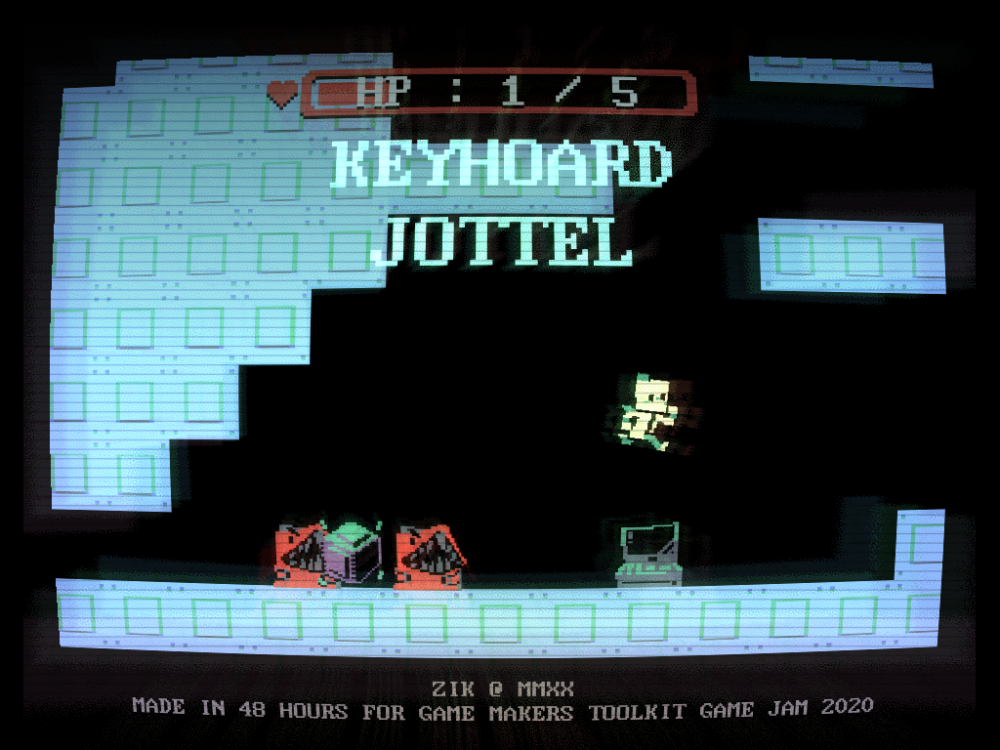
### A source code of my metroidvania game with a twist : every item and upgrades uses your limited slots of keys on your keyboard, also an entry for [GMTK Game Jam 2020](https://itch.io/jam/gmtk-2020), written in 48 hours over the span of a weekend in 2020, July.
### :point_right: See the game's [itch.io page](https://zikbakguru.itch.io/jottel) and the game's [submission page (rates & feedbacks are highly appreciated)](https://itch.io/jam/gmtk-2020/rate/699095) :point_left:
[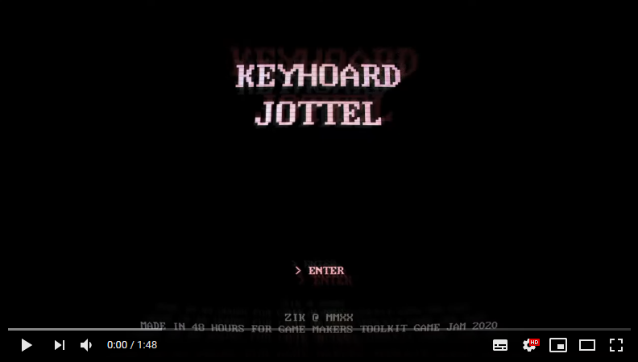](https://youtu.be/jWNddsgIwSc)
<br>(above links to the youtube video of gameplay)

## The game features...
* Retro CRT effect, achieved with GLSL ES shaders
* Items & upgrades that once picked up, must be assigned to your available key on your keyboard (some upgrades even requires the user to press the assigned key in order to use it, for example : if you assigned your jump upgrades to Z button, you have to press Z in order to jump)
* Cliche-esque upgrades that is present in almost every single Metroidvania games, Including the good old jump, sprint, shoot etc..
* Kicking move that lets players to climb the wall by succesive wall-kicking
* C64-inspired sprite graphics
* Grahpics & sound & music assets carefully handcrafted by me

## Also included : the project files for the game's map, sound effects and music.
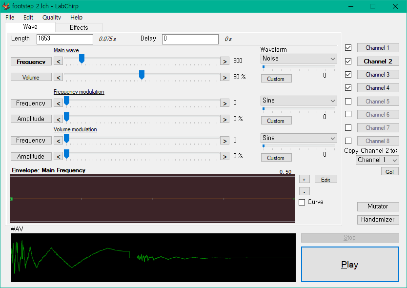
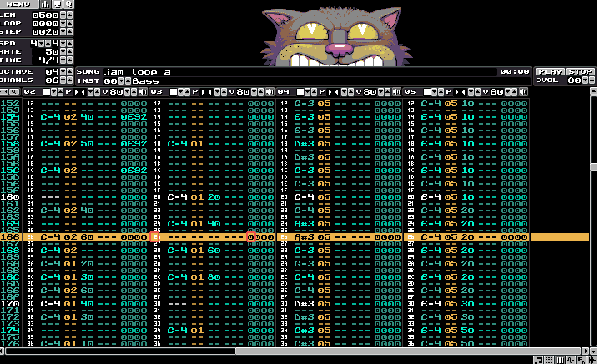
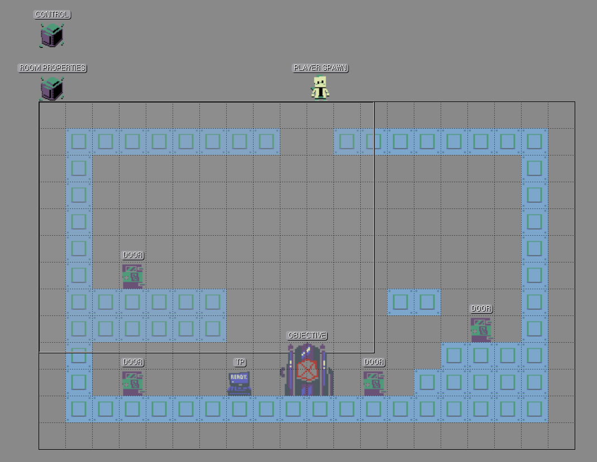
They're conveniently placed inside of `/ASSETS` folder. The map file (`.tmx` file) can be opened with [Tiled map editor](https://thorbjorn.itch.io/tiled), The sound effect file (`.lch` files) can be opened with sfx synthesizer [LabChirp](https://labbed.itch.io/labchirp), And the music file (`loop1.kt` file) can be opened with music tracker [Klystrack](https://kometbomb.itch.io/klystrack).

## :warning: Warning : Since this build is the exact same build as the gamejam build, This game contains various flaws! (for example; players can softlock the game by either falling out of bounds using the kicking moves or leaving the essential upgrades in a unreachable places) :warning:


## Credits
* Font : [Sam3KRFont by hurss (MIT license)](https://github.com/hurss/fonts)
```
The MIT License (MIT)
Copyright (c) 2016 Damheo Lee (leedheo@gmail.com),
with Reserved Font Name DOSMyungjo, DOSGothic, DOSSaemmul, Sam3KRFont, MiraeroNormal,
its OTF and BDF suffix name. (e.g. DOSMyungjo OTF)

Permission is hereby granted, free of charge, to any person obtaining a copy
of this software and associated documentation files (the "Software"), to deal
in the Software without restriction, including without limitation the rights
to use, copy, modify, merge, publish, distribute, sublicense, and/or sell
copies of the Software, and to permit persons to whom the Software is
furnished to do so, subject to the following conditions:

The above copyright notice and this permission notice shall be included in all
copies or substantial portions of the Software.

THE SOFTWARE IS PROVIDED "AS IS", WITHOUT WARRANTY OF ANY KIND, EXPRESS OR
IMPLIED, INCLUDING BUT NOT LIMITED TO THE WARRANTIES OF MERCHANTABILITY,
FITNESS FOR A PARTICULAR PURPOSE AND NONINFRINGEMENT. IN NO EVENT SHALL THE
AUTHORS OR COPYRIGHT HOLDERS BE LIABLE FOR ANY CLAIM, DAMAGES OR OTHER
LIABILITY, WHETHER IN AN ACTION OF CONTRACT, TORT OR OTHERWISE, ARISING FROM,
OUT OF OR IN CONNECTION WITH THE SOFTWARE OR THE USE OR OTHER DEALINGS IN THE
SOFTWARE.
```
* Ambient computer droning sound : [Server drone.wav by Jandre160108 (CC0 license)](https://freesound.org/people/Jandre160108/sounds/437404/)

## Developement progress & misc. footages
### **(Check out my twitter thread where I've posted a lot of in-development footages hete : [twitter.com/ZIKBAKGURI/status/1281659093766115328](https://twitter.com/ZIKBAKGURI/status/1281659093766115328))**
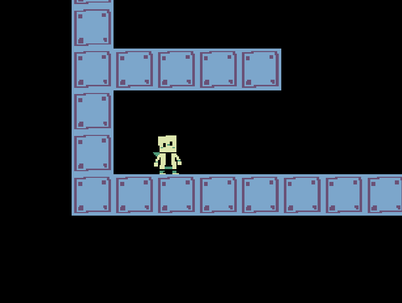
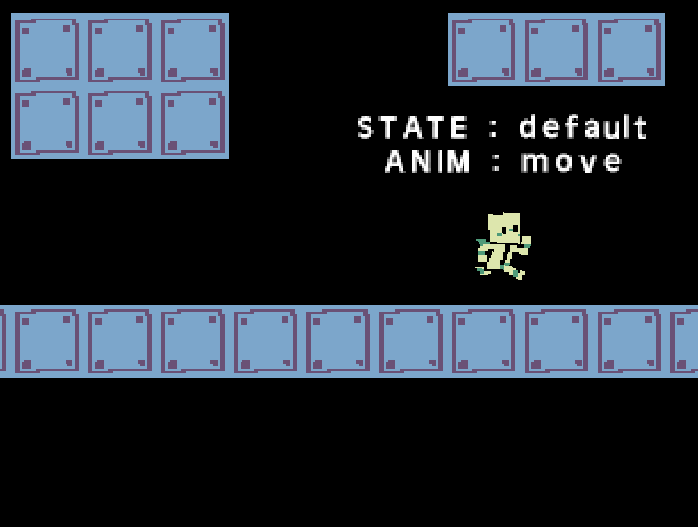
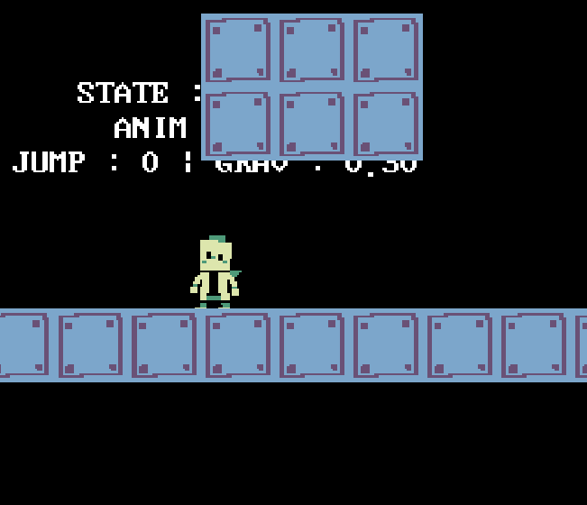
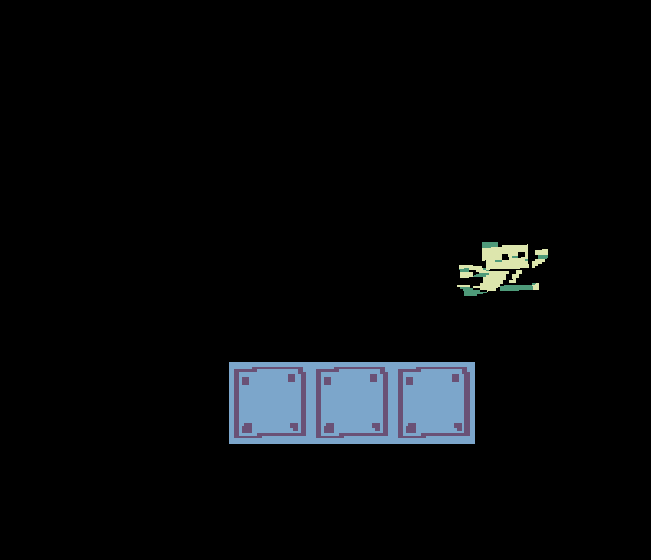
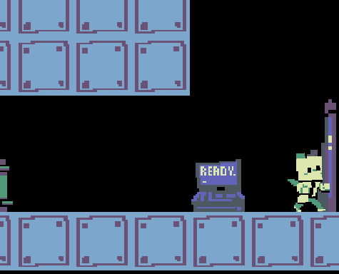
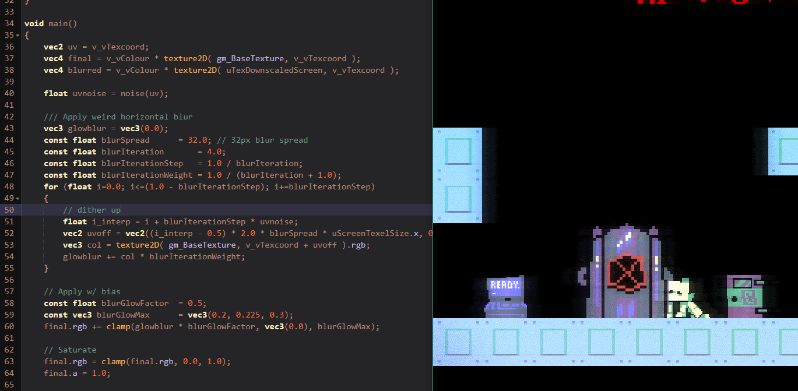
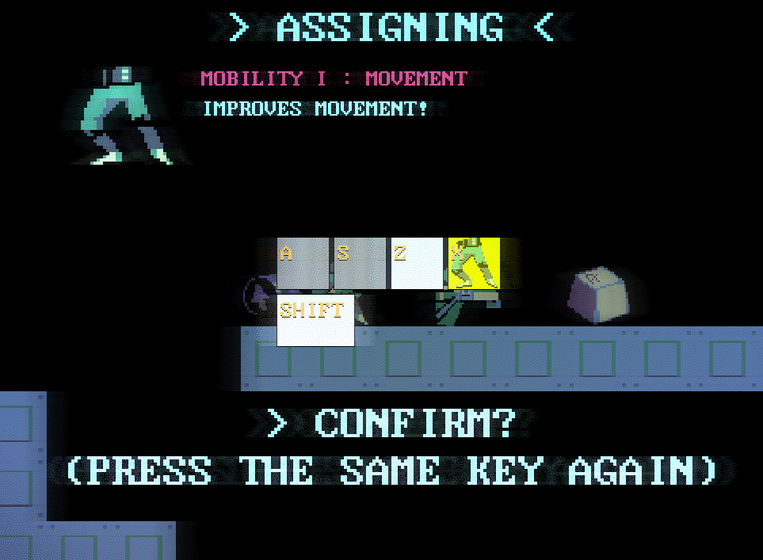
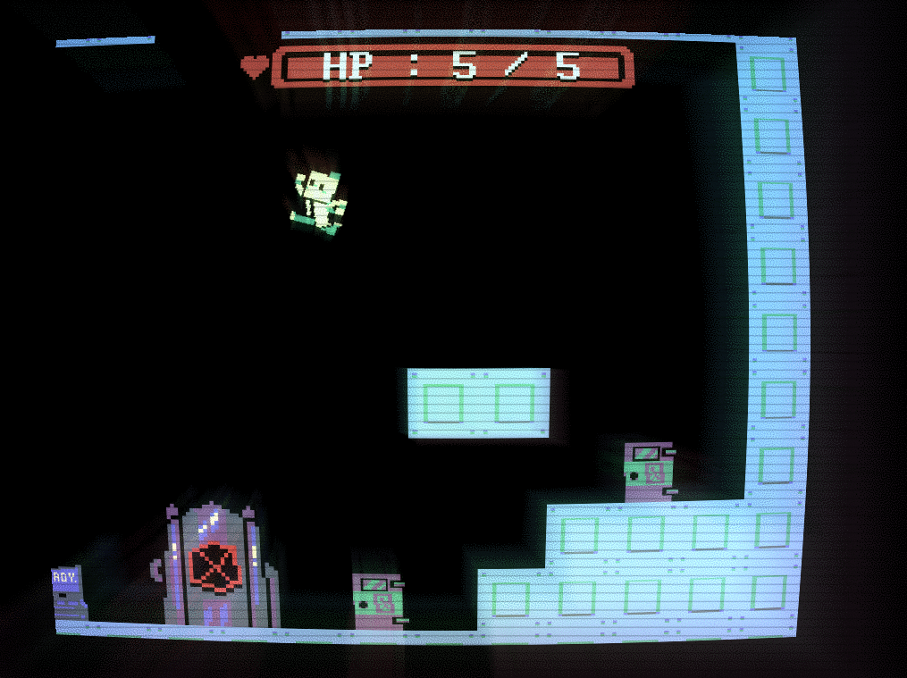